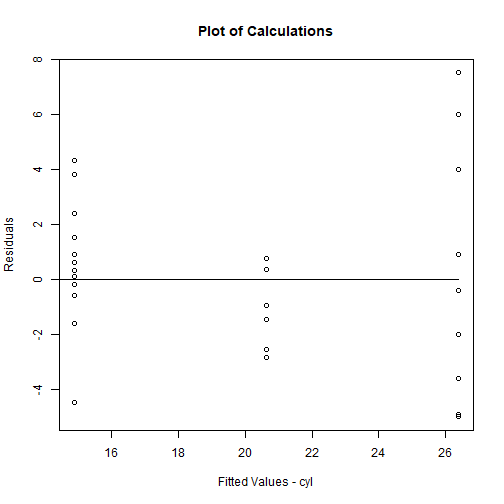

Pitch
========================================================
author: Joel Varela Donado
date: May 16, 2020
autosize: true

Contents of Shiny Web App
========================================================


One of the default data sets in R is the $mtcars$ dataset. This shiny web app will perform Linear Regression on its variables and display results dynamically. 

Web application has 2 parts

* Left Sidebar for Input
* Right Main panel for output

Left side bar input Panels
========================================================
The left bar has an Outcome variable and the Predictors. Using the  radio buttons and check boxes you'll be able to pick to start a linear model.
- You can pick several Predictors.
- Picking the same Outcome as Predictor has no effect.
- Changing your picks will update the results dynamically
$mtcars$ contains the following variables:

```r
names(mtcars)
```

```
 [1] "mpg"  "cyl"  "disp" "hp"   "drat" "wt"   "qsec" "vs"   "am"   "gear"
[11] "carb"
```

Right side main Output Panel
========================================================
You will see the results of your picks on the right hand side:

* Plot of fitted values vs Residuals
* Summary of the linear model with coefficients, residuals, statistics, and of course, the formula used.


Right side main Output Panel
========================================================

Here's an example, if you pick MPG as outcome and CYL as predictor then the plot will be:

```r
model=lm(mpg ~ cyl, data=mtcars)
plot(model$residuals ~ model$fitted.values, xlab = "Fitted Values - cyl", ylab = "Residuals", main = "Plot of Calculations")
lines(c(0,max(model$fitted.values)), c(0,0))
```



Right side main Output Panel
========================================================

And for the same example the printed result will be:


```r
summary(model)
```

```

Call:
lm(formula = mpg ~ cyl, data = mtcars)

Residuals:
    Min      1Q  Median      3Q     Max 
-4.9814 -2.1185  0.2217  1.0717  7.5186 

Coefficients:
            Estimate Std. Error t value Pr(>|t|)    
(Intercept)  37.8846     2.0738   18.27  < 2e-16 ***
cyl          -2.8758     0.3224   -8.92 6.11e-10 ***
---
Signif. codes:  0 '***' 0.001 '**' 0.01 '*' 0.05 '.' 0.1 ' ' 1

Residual standard error: 3.206 on 30 degrees of freedom
Multiple R-squared:  0.7262,	Adjusted R-squared:  0.7171 
F-statistic: 79.56 on 1 and 30 DF,  p-value: 6.113e-10
```

